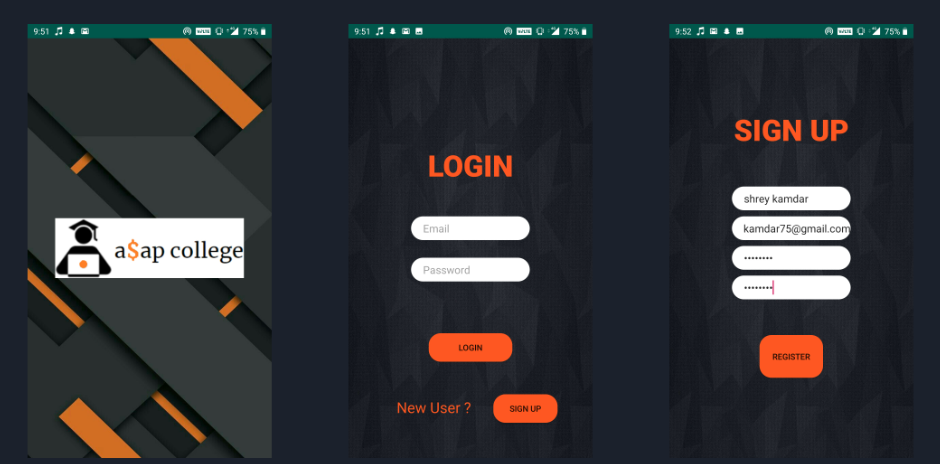
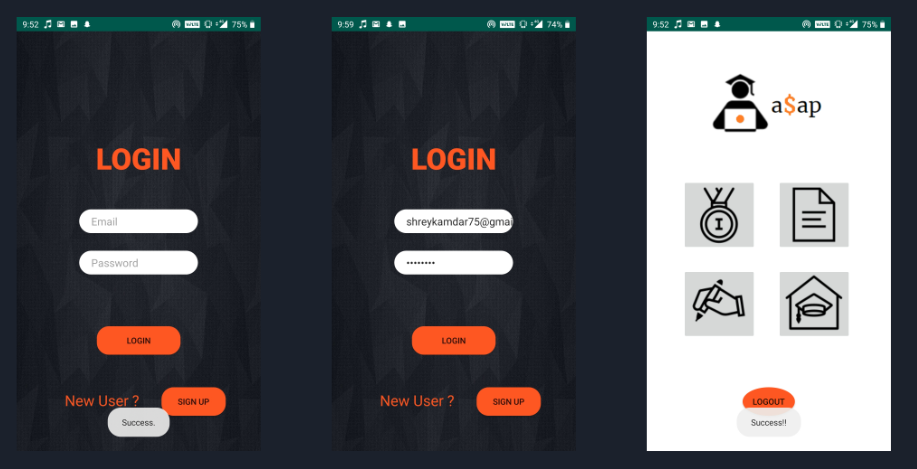

<!-- PROJECT LOGO -->
 

  <a>
    

  <h3 align="center">A$AP College</h3>

  

    Choose your college, the EA$Y way!
     
  

<!-- TABLE OF CONTENTS -->

  
Table of Contents

  <ol>
    <li>
      <a href="#about-the-project">About The Project</a>
      <ul>
        <li><a href="#built-with">Built With</a></li>
      </ul>
    </li>
    <li>
      <a href="#getting-started">Getting Started</a>
      <ul>
        <li><a href="#prerequisites">Prerequisites</a></li>
        <li><a href="#installation">Installation</a></li>
      </ul>
    </li>
    <li><a href="#usage">Usage</a></li>
    <li><a href="#roadmap">Roadmap</a></li>
    <li><a href="#contributing">Contributing</a></li>
    <li><a href="#license">License</a></li>
    <li><a href="#contact">Contact</a></li>
    <li><a href="#acknowledgments">Acknowledgments</a></li>
  </ol>

<!-- ABOUT THE PROJECT -->
## About The Project

a$ap college is a one stop solution for high school pass outs applying for undergraduate programs.
The objective is to ease the chaotic process of application to colleges by making it intuitive and convenient. 

(<a href="#readme-top">back to top</a>)

## Built With

* Android
* Javascript
* XML

(<a href="#readme-top">back to top</a>)

<!-- USAGE EXAMPLES -->
## UI Design

<!-- ACKNOWLEDGMENTS -->
## Features and Modules

* Choice of college
* Information about the competitive exams (for the selected college)
* Cutoffs  over the last five years (for the selected competitive exam)
* Rank predictor based on the last five years’ data
* Information about the programs offered by the college (B.Tech, MBA Tech, M.Tech)
* Student reviews on the college (authenticated by the college  email id)
* Application to the selected college using
* Document Upload
* Integration of payment wallets for application fee

## Future Plan

For the next step, we plan to integrate our collected data with the app. The next immediate modules we will be developing are college information, competitive exam information, cutoffs for those exams and student reviews.

For our future goals, we plan to include a rank predicting algorithm, and also change the process of application to colleges by uploading documents and integrating online payment for application fees.

